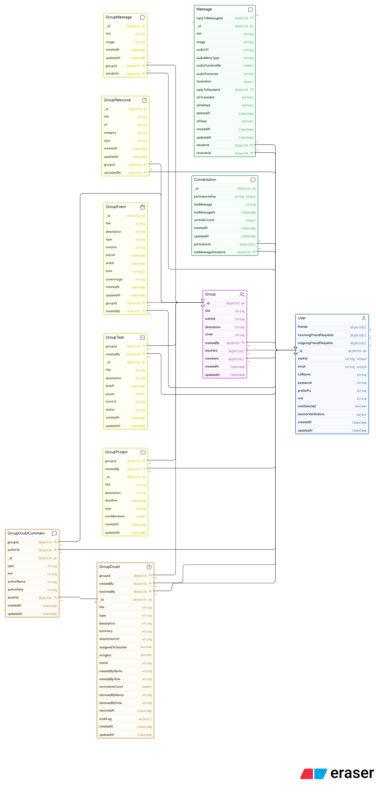
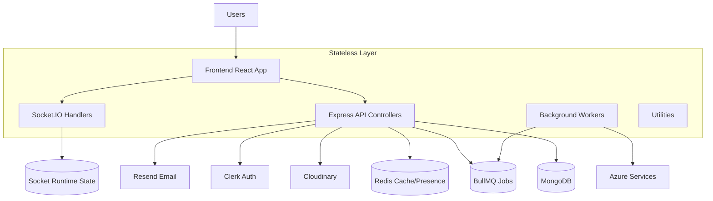
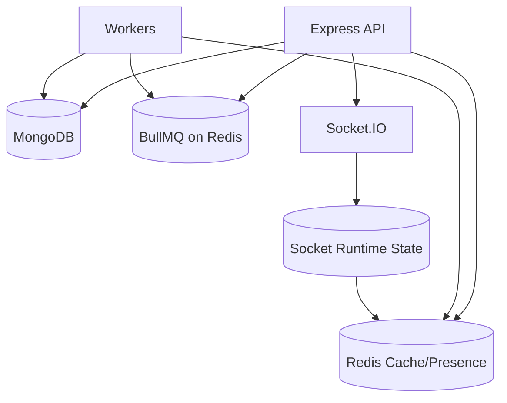
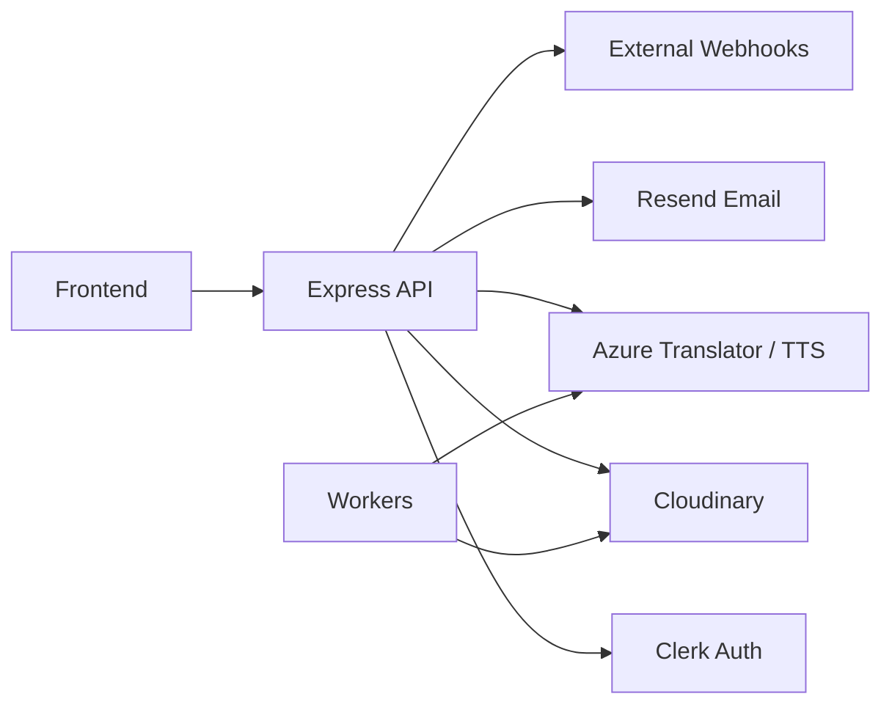

# CampusConnect Deployment Guide (Render)

This repo contains two apps:

- `backend/`: Node/Express API + Socket.IO
- `frontend/`: Vite React app

## Backend (Render Web Service)

**Root directory:** `backend`

**Build command:** `npm install`

**Start command:** `npm run start`

**Environment variables:**

- `NODE_ENV=production`
- `PORT` (Render sets this automatically)
- `MONGO_URI`
- `CLIENT_URL` (your frontend Render URL, e.g. `https://campusconnect.onrender.com`)
- `REDIS_URL` (use `rediss://` for managed Redis over TLS)
- `REDIS_KEY_PREFIX` (optional, defaults to `campusconnect`)
- `CLERK_SECRET_KEY`
- `CLERK_WEBHOOK_SECRET`
- `CLERK_PUBLISHABLE_KEY`
- `RESEND_API_KEY` (if email is enabled)
- `EMAIL_FROM` (if email is enabled)
- `EMAIL_FROM_NAME` (if email is enabled)
- `CLOUDINARY_CLOUD_NAME` (if uploads are enabled)
- `CLOUDINARY_API_KEY` (if uploads are enabled)
- `CLOUDINARY_API_SECRET` (if uploads are enabled)
- `ARCJET_KEY` (if Arcjet is enabled)
- `ARCJET_ENV` (if Arcjet is enabled)
- `AZURE_SPEECH_KEY` (if speech features are enabled)
- `AZURE_SPEECH_REGION` (if speech features are enabled)
- `AZURE_TRANSLATOR_KEY` (if translation is enabled)
- `AZURE_TRANSLATOR_ENDPOINT` (if translation is enabled)
- `AZURE_TRANSLATOR_REGION` (if translation is enabled)
- `TEACHER_INVITE_CODE` (optional, default is `CAMPUS2026`)
- `SERVE_STATIC=false` (set to `true` only for single-service deployments)

BullMQ reuses the same Redis instance as the cache layer, so one `REDIS_URL` is enough.

If you want a dedicated BullMQ worker process, run `npm run worker` from `backend/` after setting the Redis variables.

## Frontend (Render Static Site)

**Root directory:** `frontend`

**Build command:** `npm install && npm run build`

**Publish directory:** `dist`

**Environment variables:**

- `VITE_API_BASE_URL` (your backend Render URL, e.g. `https://campusconnect-api.onrender.com`)
- `VITE_CLERK_PUBLISHABLE_KEY`

## Local development

**Backend:**

```
cd backend
npm install
npm run dev

# optional, in a second terminal for queue processing
npm run worker
```

**Frontend:**

```
cd frontend
npm install
npm run dev
```

## Single-service deployment (optional)

If you want the backend to serve the frontend build from the same service:

1. Use a single Render Web Service with the **root directory** set to the repo root.
2. Use **build command**: `npm run build` (this builds the frontend and copies it into `backend/frontend/dist`).
3. Use **start command**: `npm run start`.
4. Set `SERVE_STATIC=true` and `NODE_ENV=production`.
5. Set `CLIENT_URL` to the same Render URL as the backend.
6. Set `VITE_CLERK_PUBLISHABLE_KEY` for the frontend build. You can omit `VITE_API_BASE_URL` so the app uses same-origin `/api`.

## Database ER Diagram

### Database ER Diagram (visual)

The exported Eraser diagram is embedded below. If you prefer the editable Mermaid version, see the repository history.



This diagram shows the MongoDB data model behind CampusConnect. `User` is the central collection, with direct chat handled by `Message` and `Conversation`. Group-based features branch from `Group` into `GroupMessage`, `GroupResource`, `GroupEvent`, `GroupTask`, `GroupProject`, `GroupDoubt`, and `GroupDoubtComment`.

The main relationships are:

- `User` sends and receives many `Message` documents.
- `Conversation` represents a 1:1 chat thread between exactly two users.
- `Group` is created by a user and has many teachers and members.
- `GroupMessage`, `GroupResource`, `GroupEvent`, `GroupTask`, `GroupProject`, `GroupDoubt`, and `GroupDoubtComment` all belong to a `Group` through `groupId`.
- `GroupDoubt` can be resolved by a user and keeps an embedded audit log of status changes.
- `Message` supports reply references through `replyTo.messageId` and includes translation metadata for text and voice translations.

Key indexed or unique fields are also highlighted in the diagram:

- `User.email` and `User.clerkId` are unique.
- `Conversation.participantsKey` is unique.
- `Message` is indexed for direct chat history and unread lookups.
- Several group collections are indexed by `groupId` for fast per-group queries.

## System Architecture

The CampusConnect platform follows a layered, microservice-inspired architecture focused on scalability, real-time communication, and asynchronous processing. The system is organized into three logical layers: Stateless, Stateful, and Third-Party Integrations. The descriptions below are tailored to this repository (frontend in `frontend/`, backend in `backend/`).

The image below shows the request/response and event flows between users, frontend, API, sockets, and background workers.


### 1. Stateless Layer

The stateless layer contains horizontally scalable services that do not hold durable session data. These components can be replicated to handle load and are the primary entry points for users.

- **Frontend (`frontend/`) — React + Vite:** user interface, routing, and client-side state. Connects to the API and opens Socket.IO connections for realtime flows.
- **API Controllers (`backend/src/controllers/*`):** HTTP endpoints that implement business logic and orchestrate calls to the stateful layer and third-party services.
- **Socket Handlers (`backend/src/lib/socket.js`, `backend/src/middleware/socket.auth.middleware.js`):** real-time event handling for messages, typing indicators, presence, and read receipts. Uses Redis pub/sub when scaling across multiple processes.
- **Background workers (worker process):** stateless worker processes that pull jobs from `BullMQ` and call external services (Azure translation/TTS, Resend, Cloudinary tasks).


### 2. Stateful Layer

The stateful layer holds durable and shared runtime data used across the system.

- **MongoDB (`backend/src/models/*`):** primary persistent store for `User`, `Message`, `Conversation`, `Group` and related collections.
- **Redis (`backend/src/lib/redis.js`):** in-memory cache for conversation summaries, presence, rate-limits, and Socket.IO adapter state. Also used by `BullMQ` as the queue backend.
- **BullMQ (Redis-backed queues, `backend/src/queues/*`):** job queues for translations, media processing, email sending, and other async tasks.

### 3. Third-Party Integrations

CampusConnect uses third-party services for authentication, media, AI, and email:

- **Clerk** — authentication and user identity; validated in middleware and used by frontend to sign in users.
- **Cloudinary** — media uploads and CDN for profile photos, attachments, and audio files.
- **Azure (Translator / Speech)** — translation, transcription, and TTS used by background jobs (see `backend/src/lib/translation.js`).
- **Resend** — transactional email delivery for invites, notifications, and verification flows.
- **External Webhooks** — optional inbound integrations for LMS or other systems that trigger background workflows.

Refer to `backend/src/lib/translation.js`, `backend/src/queues/translation.queue.js`, `backend/src/lib/cloudinary.js`, and `backend/src/lib/authCache.js` for concrete implementation details.

---

This System Architecture section complements the Database ER Diagram above and the Mermaid/state diagrams in this README. If you'd like, I can extract these diagrams to a dedicated `docs/architecture.md` file and add smaller PNGs for better README rendering on GitHub.


## Stateless Interaction Diagram

### Stateless Interaction Diagram (Visual)

The following Mermaid diagram shows the stateless request/response and event flows in CampusConnect: how users interact with the frontend, how the frontend talks to the Express API and Socket.IO, and how background workers (translation, media processing) are dispatched via BullMQ/Redis.



Key flows illustrated:

- **User → Frontend:** UI interactions, message composition, and file uploads.
- **Frontend → API (REST):** CRUD operations, file uploads to Cloudinary, and auth-guarded endpoints.
- **Frontend ↔ Socket.IO:** Real-time events (new messages, typing, presence, read receipts).
- **API → MongoDB:** Durable storage for users, conversations, messages, groups, and related entities.
- **API → Redis / BullMQ:** Short-lived presence/cache in Redis and job enqueueing for async tasks (translations, TTS) via BullMQ.
- **Workers → Azure / Cloudinary / Resend:** Workers perform translation/TTS using Azure, persistent media operations to Cloudinary, and email sending via Resend.

This diagram is intentionally high-level and focuses on stateless interactions; it complements the Database ER Diagram above which focuses on persistent data structures.

## Stateful Components

### Stateful Components (visual)

The stateful layer contains durable and semi-durable stores used at runtime: MongoDB for persistent domain data, Redis for caching and presence, and BullMQ (backed by Redis) for background jobs. These components manage durable state and support scaling and isolation.



Key notes:

- `MongoDB` stores Users, Conversations, Messages, Groups, and related entities (durable). See the Database ER Diagram above.
- `Redis` holds short-lived caches (conversation summaries), presence info, and rate-limiting counters.
- `BullMQ` enqueues long-running/async jobs (translations, TTS, media processing); workers pull from the queue and call external services.

## Third-Party Integrations

### Third-Party Integrations (visual)

CampusConnect relies on several third-party services for auth, media, AI, and email. This section summarizes each integration and where it's used.



Integrations summary:

- `Clerk`: authentication and user identity; used by the frontend and validated in backend controllers/middleware.
- `Cloudinary`: file and media storage for images, audio, and attachments; uploads occur via the backend and are stored externally.
- `Azure Translator / Speech`: handles text translation and speech synthesis for messages; invoked by worker jobs.
- `Resend`: transactional email delivery for invites, notifications, and digests.
- `External Webhooks`: optional inbound integrations (e.g., LMS or third-party events) that the API ingests.

Refer to `backend/src/lib/translation.js`, `backend/src/queues/translation.queue.js`, and `backend/src/lib/cloudinary.js` for implementation details.
